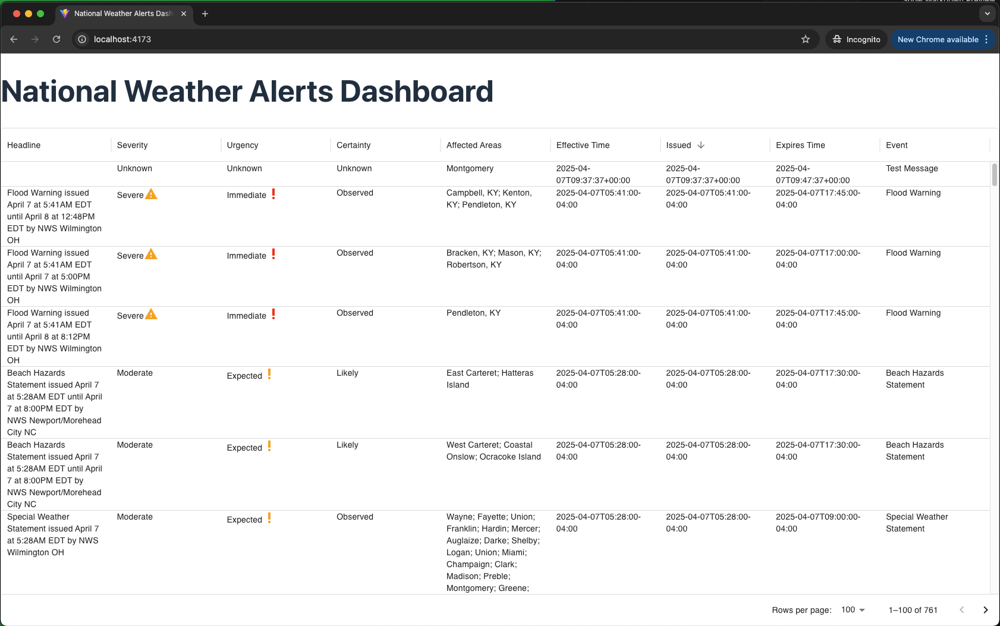

# National Weather Alerts Dashboard

## Overview

This is a react application to display alerts from the National Weather Service API.

[National Weather Service API](https://www.weather.gov/documentation/services-web-api#/)

You can see a live working example at: <https://weather-alerts-tom-newton.netlify.app/>



## Getting Started

### Prerequisites

Ensure you have the following installed:

- Node.js (v18 or higher)
- npm or yarn

### Using .nvmrc

If you use `nvm` (Node Version Manager), you can run the following command to use the correct Node.js version specified in the `.nvmrc` file:

```bash
nvm use
```

### Installation

1. Clone the repository:

   ```bash
   git clone https://github.com/TomNewton1/weather-alerts.git
   cd weather-alerts
   ```

2. Install dependencies:

   ```bash
   npm install
   ```

3. Create `.env.development` and `.env.test` files:

   - For local development, create a `.env.development` file in the root of the project. This file should contain any environment variables required for the application to run. For example:

     ```env
     VITE_NODE_ENV=development
     VITE_API_BASE_URL=https://development-api.local
     ```

   - For testing, create a `.env.test` file in the root of the project. This file should contain any environment variables required for running tests. For example:

     ```env
     VITE_NODE_ENV=test
     VITE_API_BASE_URL=https://test-api.local
     ```

4. Start the development server:

   ```bash
   npm run dev
   ```

5. Open the app in your browser at `http://localhost:5173`.

## Mocking API Requests

This project uses [Mock Service Worker (MSW)](https://mswjs.io/) to mock API requests during development and testing. The mock handlers are defined in [`src/mocks/handlers.ts`](src/mocks/handlers.ts).

## Testing

This project uses [Vitest](https://vitest.dev/) for unit testing. To run tests, use:

```bash
npm run test
```
